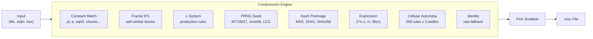
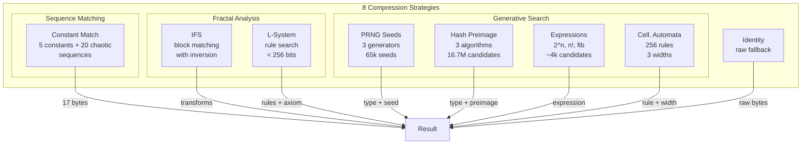
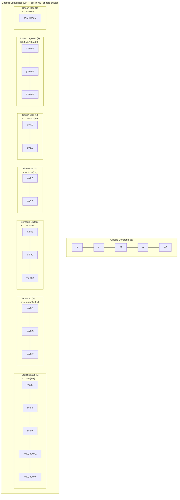
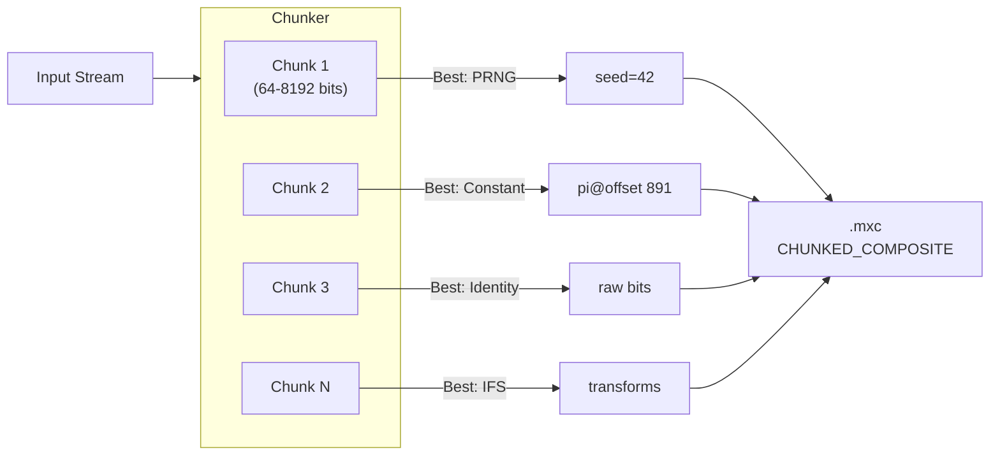
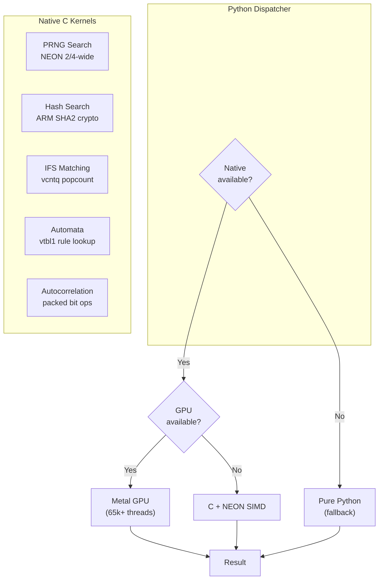

# maxcomp

Universal re-compression of arbitrary bit streams. Explores whether data can be represented more compactly as references into mathematical constants, chaotic sequences, fractal self-similarity, or short generative programs.

## How It Works

maxcomp tries 8 compression strategies in parallel against your input data, picks whichever produces the smallest output, and wraps the result in a `.mxc` file that can be losslessly decompressed back to the original.



The core idea: if your data happens to appear as a substring in pi starting at bit 47,293 — store `(pi, 47293, length)` in 17 bytes instead of the original data. The same principle applies to chaotic sequences, PRNG outputs, hash digests, and more.

## Installation

```bash
git clone https://github.com/martinpeck/maxcomp.git
cd maxcomp
python3 -m venv .venv && source .venv/bin/activate
pip install -e ".[dev]"
```

**Optional — native C acceleration (macOS arm64):**

```bash
pip install cffi
cd maxcomp/native && make && cd ../..
```

This builds `_maxcomp_native.dylib` with ARM NEON SIMD and crypto intrinsics, providing up to 18,000x speedup on brute-force searches.

## Quick Start

```bash
# Compress a file
maxcomp compress -i data.bin -o data.mxc

# Decompress back
maxcomp decompress -i data.mxc -o restored.bin

# Analyze all strategies without writing output
maxcomp analyze -i data.bin --json

# Inspect a compressed file
maxcomp info data.mxc
```

## Compression Strategies



### Strategy Details

| # | Strategy | What it does | Payload |
|---|----------|-------------|---------|
| 0 | **Identity** | Store raw bits (always succeeds) | Original bytes |
| 1 | **Constant Match** | Find input as substring in pi, e, logistic map, Lorenz, etc. | 17 bytes |
| 2 | **Fractal IFS** | Detect self-similar block mappings with optional inversion | Variable |
| 3 | **L-System** | Find production rules that generate the bit pattern | Variable |
| 4 | **PRNG Seed** | Brute-force MT19937/xorshift128/LCG seeds | 17 bytes |
| 5 | **Hash Preimage** | Find short input whose MD5/SHA1/SHA256 prefix matches | Variable |
| 6 | **Expression** | Match against 2^n-1, n!, fib(n), primes, powers | Variable |
| 7 | **Cellular Automata** | Search 256 elementary CA rules across 3 widths | Variable |

## Searchable Sequences

The constant match strategy searches for input data as a substring within 25 binary sequences:



All sequences are computed at arbitrary precision using mpmath and cached to disk (`~/.cache/maxcomp/`) for reuse.

## Search Windows

Control how deep into each sequence to search:

| Preset | Size | Bits | CLI Flag |
|--------|------|------|----------|
| small | 1 KB | 8,192 | `--window small` |
| medium | 8 KB | 65,536 | `--window medium` |
| default | ~12 KB | 100,000 | *(default)* |
| large | 64 KB | 524,288 | `--window large` |
| xlarge | 256 KB | 2,097,152 | `--window xlarge` |
| huge | 1 MB | 8,388,608 | `--window huge` |

Timeouts auto-scale with window size (30s for small/default, up to 5 minutes for huge). Use `--tiered-search` for progressive expansion — tries the smallest window first and only expands if time remains.

```bash
# Search pi/e/etc up to 64KB deep with chaotic sequences enabled
maxcomp compress -i data.bin -o data.mxc --window large --enable-chaotic

# Progressive search up to 1MB
maxcomp compress -i data.bin -o data.mxc --window huge --tiered-search

# Exact window size
maxcomp compress -i data.bin -o data.mxc --window-bits 500000
```

## Chunked Compression

For larger inputs, maxcomp splits the data into chunks and compresses each independently, picking the best strategy per chunk:



**Default chunk sizes:** 64, 128, 256, 512, 1024, 2048, 4096, 8192 bits.
**Extended** (for `--window large` and above): adds 16384, 32768, 65536 bits.

## Native Acceleration

On macOS arm64, the native C library provides massive speedups via ARM NEON SIMD, ARM crypto extensions, and optional Metal GPU compute:



| Component | Technique | Speedup |
|-----------|-----------|---------|
| PRNG xorshift search | NEON `uint64x2_t` (2 seeds/cycle) | ~18,000x |
| PRNG LCG search | NEON `uint32x4_t` (4 seeds/cycle) | ~10,000x |
| SHA-256 hashing | ARM crypto (`vsha256hq_u32`) | ~5-10x |
| IFS block matching | NEON `vcntq_u8` popcount | ~100x |
| Automata rules | NEON `vtbl1_u8` lookup | ~50x |

Build with `cd maxcomp/native && make`. GPU shaders: `make metal`.

## .mxc File Format

```
┌─────────────────────────────────────────┐
│  Header (16 bytes)                      │
│  ┌──────────┬───────────────────────┐   │
│  │ Magic    │ MXC\0  (4 bytes)      │   │
│  │ Version  │ 1      (1 byte)       │   │
│  │ Flags    │ 0x01 = chunked        │   │
│  │ Method   │ MethodID (1 byte)     │   │
│  │ Reserved │ 0x00                  │   │
│  │ Orig Len │ bit count (uint64 BE) │   │
│  └──────────┴───────────────────────┘   │
├─────────────────────────────────────────┤
│  Payload (variable)                     │
│  Method-specific compressed data        │
└─────────────────────────────────────────┘
```

## CLI Reference

```
maxcomp compress  [-i FILE] [-o FILE] [-f auto|raw|hex|bin]
                  [--timeout N] [--no-chunking]
                  [--window small|medium|default|large|xlarge|huge]
                  [--window-bits N] [--tiered-search]
                  [--enable-chaotic]

maxcomp decompress [-i FILE] [-o FILE] [-f raw|hex|bin]

maxcomp analyze   [-i FILE] [-f auto|raw|hex|bin] [--json]
                  [--timeout N] [--no-chunking]
                  [--window ...] [--enable-chaotic]

maxcomp info FILE
```

## Examples

```bash
# Compress from hex string
echo "deadbeefcafebabe0123456789abcdef" | maxcomp compress -f hex -o out.mxc

# Analyze with all strategies including chaotic sequences
maxcomp analyze -i data.bin --enable-chaotic --window medium --json

# Compress with large search window and progressive tiers
maxcomp compress -i data.bin -o data.mxc --window xlarge --tiered-search -v

# Round-trip verification
maxcomp compress -i original.bin -o compressed.mxc
maxcomp decompress -i compressed.mxc -o restored.bin
diff original.bin restored.bin  # should be identical
```

## Project Structure

```
maxcomp/
├── maxcomp/
│   ├── cli.py                    # CLI (compress, decompress, analyze, info)
│   ├── engine.py                 # Parallel strategy orchestration
│   ├── bitstream.py              # Immutable bit sequence type
│   ├── format.py                 # .mxc binary format
│   ├── chunker.py                # Chunk splitting/reassembly
│   ├── stats.py                  # Statistics reporting
│   ├── strategies/               # 4 strategy modules (8 methods)
│   ├── constants/                # 5 constants + 20 chaotic sequences
│   ├── generators/               # PRNG, hash, expression, automata search
│   ├── fractal/                  # IFS, L-system, autocorrelation
│   └── native/                   # C/NEON/Metal acceleration layer
├── tests/                        # 123 tests
├── pyproject.toml
└── LICENSE
```

## Running Tests

```bash
pytest tests/ -v
```

## License

MIT
